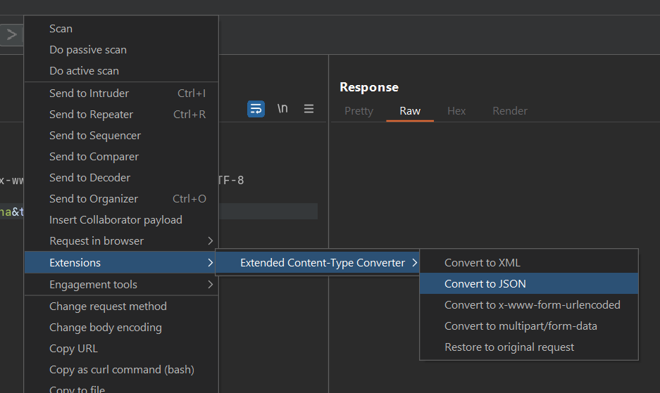

Extended Content-Type Converter
=========

Burp extension to convert between XML, JSON and form-urlencoded.

Requirements: Java 17 and above (I re-wrote this extension with java 17)

Right-click on a request in an editable message window such as Repeater, Intruder, and the Proxy interceptor

Conversions between those content types are supported:

* XML
* JSON
* x-www-form-urlencoded
* multipart/form-data

You can also revert changes that are made to the original request.

Note that wrong formatted data will not be converted. For example, attempt to convert an invalid JSON to x-www-form-urlencoded will be ignored.

Build instruction
=========
### Using Intellij IDEA (recommended) ###
- Just import this project to IDEA and wait for Gradle to load dependencies.
- Open CLI, navigate to the directory where *build.gradle* located
- Run `gradle fatjar`:


### Using CLI ###
- ...

How to use
=========
- The .jar file is located at build/libs:


- Import to your BurpSuite and enjoys!



Examples usage
=========

#### x-www-form-urlencoded ####

```
POST /test HTTP/1.1
Host: www.example.com
Proxy-Connection: keep-alive
Content-Length: 77

user[permissions][]="read"&user[permissions][]="write"&user[permissions][]="execute"

```

#### To XML ####
```
POST /test HTTP/2
Host: www.example.com
Proxy-Connection: keep-alive
Content-Length: 231
Content-Type: application/xml;charset=UTF-8

<?xml version="1.0" encoding="UTF-8" standalone="no"?>
<root>
    <user>
        <permissions>"read"</permissions>
        <permissions>"write"</permissions>
        <permissions>"execute"</permissions>
    </user>
</root>
```
#### To JSON ####
```
POST /test HTTP/2
Host: www.example.com
Proxy-Connection: keep-alive
Content-Length: 75
Content-Type: application/json;charset=UTF-8

{"user": {"permissions": [
  "\"read\"",
  "\"write\"",
  "\"execute\""
]}}
```

#### JSON to XML ####

```
POST /test HTTP/2
Host: www.example.com
Proxy-Connection: keep-alive
Content-Length: 88
Content-Type: application/json;charset=UTF-8

{"user": {
  "perm": [
    "read",
    {"admin": "false"}
  ],
  "home": "/home/user"
}}
```
#### To XML ####
```
POST /test HTTP/2
Host: www.example.com
Proxy-Connection: keep-alive
Content-Length: 225
Content-Type: application/xml;charset=UTF-8

<?xml version="1.0" encoding="UTF-8" standalone="no"?>
<root>
    <user>
        <perm>read</perm>
        <perm>
            <admin>false</admin>
        </perm>
        <home>/home/user</home>
    </user>
</root>
```

#### To x-www-form-urlencoded ####
```
POST /test HTTP/2
Host: www.example.com
Proxy-Connection: keep-alive
Content-Length: 65
Content-Type: application/x-www-form-urlencoded;charset=UTF-8

user[perm][]=read&user[perm][][admin]=false&user[home]=/home/user
```
